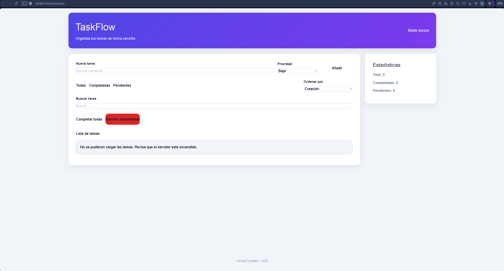
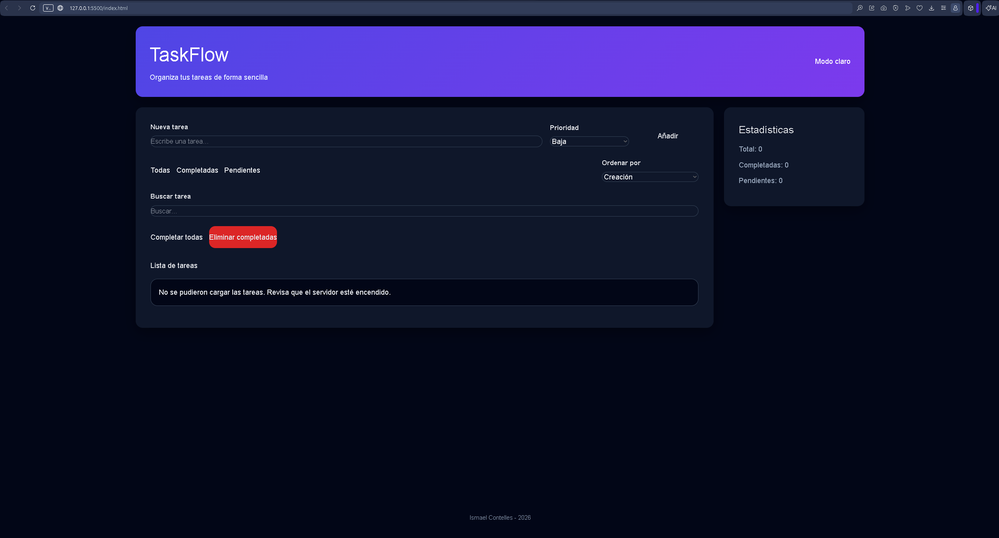
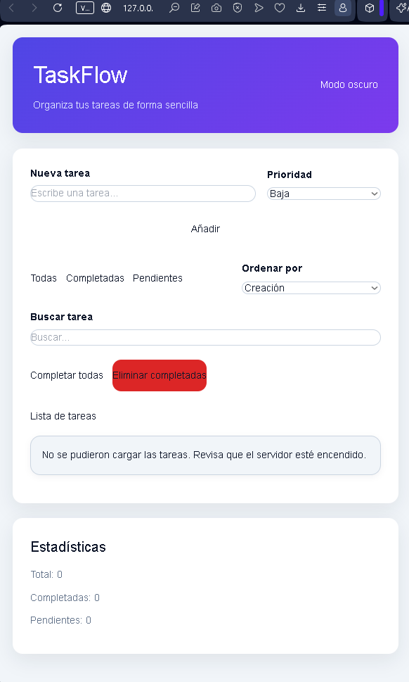

# TaskFlow - Full Stack Task Manager


---

# Descripción

TaskFlow es una aplicación full stack para la gestión de tareas desarrollada con HTML, CSS, JavaScript, Node.js y Express.js.

La aplicación permite:

- crear tareas
- completar tareas
- eliminar tareas
- gestionar prioridades
- buscar tareas
- ordenar tareas
- usar modo oscuro
- responsive design
- trabajar con una API REST propia

---

# Frontend

El frontend fue desarrollado utilizando:

- HTML5
- CSS3
- JavaScript Vanilla
- Fetch API

## Funciones principales

- renderizado dinámico de tareas
- búsqueda de tareas
- ordenación
- prioridades
- modo oscuro
- responsive design
- conexión con API REST

## Archivo principal

```txt
app.js
```

---

# Backend

El backend fue desarrollado utilizando:

- Node.js
- Express.js
- Swagger UI
- Middleware personalizado

## Funciones principales

- gestión API REST
- manejo de peticiones HTTP
- lógica de negocio
- middlewares
- manejo global de errores
- documentación Swagger

## Entrada principal

```txt
server/src/index.js
```

---

# Documentación

La documentación técnica completa del backend y arquitectura del proyecto se encuentra aquí:

[README Técnico](docs/readmi-tecnico.md)

## Swagger UI

```txt
http://localhost:3000/api-docs
```

---

# Funcionalidades principales

- Crear tareas
- Completar tareas
- Eliminar tareas

## Prioridades

- Baja
- Media
- Alta

## Extras

- Ordenar tareas
- Buscar tareas
- Responsive Design
- Dark Mode
- API REST
- Middleware logger
- Manejo global de errores

---

# Arquitectura del proyecto

```txt
miproyecto
│
├── docs                            # Documentación del proyecto
│   ├── images                      # Capturas README
│   ├── backend-api.md              # Documentación inicial API
│   └── readme-tecnico.md           # Documentación técnica
│
├── server                          # Backend Express
│   │
│   ├── src
│   │   │
│   │   ├── config                  # Configuración y variables
│   │   ├── controllers             # Controladores HTTP
│   │   ├── middlewares             # Middlewares personalizados
│   │   ├── routes                  # Endpoints API REST
│   │   ├── services                # Lógica de negocio
│   │   ├── swagger.js              # Configuración Swagger
│   │   └── index.js                # Entrada principal backend
│   │
│   ├── .env                        # Variables de entorno
│   ├── package.json                # Dependencias backend
│   └── package-lock.json
│
├── src
│   └── api
│       └── client.js               # Comunicación Fetch API
│
├── app.js                          # Lógica principal frontend
├── index.html                      # Estructura HTML
├── style.css                       # Estilos y responsive
└── README.md                       # Documentación principal
```

---

# Capturas

## Modo claro



## Modo oscuro



## Modo móvil



---

# Tecnologías utilizadas

## Frontend

- HTML5
- CSS3
- JavaScript
- Fetch API

## Backend

- Node.js
- Express.js
- Swagger UI
- Dotenv
- Cors
- Nodemon

---

# Autor

**Ismael Contelles - 2026**